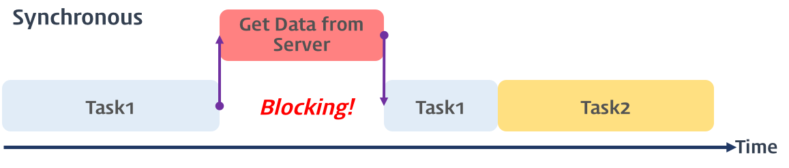
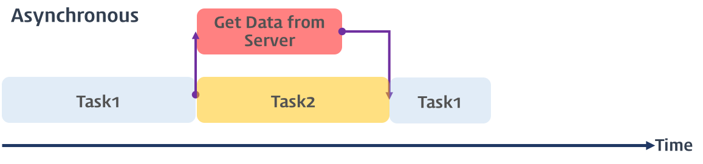

# 비동기 처리

## 1. 동기(Synchronous)와 비동기(Asynchronous)

### 1) 동기

- 직렬적으로 작업을 수행
- 특정 작업이 완료될 동안 나머지 작업은 기다렸다가 차례대로 작업을 실행하는 방식
- 서버에 데이터를 요청하고 응답할 때까지 이후의 작업들은 블로킹됨
- 실제로 CPU가 느려지는 것은 아니지만, 시스템의 전체적인 효율이 저하됨
- 총 실행 시간으로 따지면 비동기 방식보다 느림
  <br>
  
  이미지 출처: [동기식 처리 모델(Synchronous processing model)](https://poiemaweb.com/es6-promise)

### 2) 비동기

- 병렬적으로 작업을 수행
- 특정 작업의 완료를 기다리지 않고 다음 코드를 먼저 실행하는 방식
- A라는 작업이 실행되는 시간 동안 B라는 작업을 진행할 수 있으므로, 자원을 효율적으로 사용할 수 있음
- 이때, 응답 후 처리할 callback 함수를 함께 알려주는데, 해당 작업이 완료되었을 때 callback 함수가 호출됨
- **callback 함수**는 초창기의 비동기 처리 방식에 사용되었는데, 비동기 작업이 연속적으로 여러 번 필요할 때, callback을 중첩하면 코드가 복잡해지는 한계(= callback hell, 콜백 지옥)에 부딪히게 되어, **Promise**가 등장하게 됨
- 자바스크립트 대부분의 DOM 이벤트와 Timer 함수(setTimeout, setInterval), Ajax 요청은 비동기식 처리 모델로 동작
  <br>
  
  이미지 출처: [비동기식 처리 모델(Asynchronous processing model)](https://poiemaweb.com/es6-promise)

---

## 2. Promise

- 비동기 작업의 성공, 실패 상태를 표현하는 객체
- 콜백 지옥 문제를 해결하고 비동기 코드를 보다 명확하고 구조적으로 작성할 수 있게 해줌
- Promise 생성자 함수를 통해 인스턴스화 하고, 생성자 함수는 비동기 작업을 수행할 콜백 함수를 인자로 전달받음

### 1) Promise의 상태 정보

| 상태      | 의미                                       | 구현                                               |
| --------- | ------------------------------------------ | -------------------------------------------------- |
| pending   | 비동기 처리가 아직 수행되지 않은 상태      | resolve 또는 reject 함수가 아직 호출되지 않은 상태 |
| fulfilled | 비동기 처리가 수행된 상태 (성공)           | resolve 함수가 호출된 상태                         |
| rejected  | 비동기 처리가 수행된 상태 (실패)           | reject 함수가 호출된 상태                          |
| settled   | 비동기 처리가 수행된 상태 (성공 또는 실패) | resolve 또는 reject 함수가 호출된 상태             |

### 2) Promise 호출 과정과 후속처리

#### 호출 과정

비동기 함수 내에서 Promise 객체를 생성하고, 그 내부에서 비동기 처리를 구현

✅ **비동기 처리에 성공**

- `resolve` 메소드 호출
- resolve 메소드의 인자로 비동기 처리 결과를 전달하는데, 이 처리 결과는 Promise 객체의 후속 처리 메소드로 전달됨

❌ **비동기 처리에 실패**

- `reject` 메소드 호출
- reject 메소드의 인자로 에러 메시지를 전달하는데, 이 에러 메시지는 Promise 객체의 후속 처리 메소드로 전달됨

#### 후속 처리 메소드

1. **`.then(onFulfilled, onRejected)`**

- 첫 번째 콜백 함수는 성공 시 처리 콜백 함수이고, 두 번째 콜백 함수는 실패 시 실패 처리 콜백함수
- 첫 번째 콜백 함수는 Promise가 fulfilled 상태가 되면 호출되며, 이때 콜백 함수는 Promise의 비동기 처리 결과를 인수로 전달받음
- 두 번째 콜백 함수는 Promise가 rejected 상태가 되면 호출되며, 이때 콜백 함수는 Promise의 에러를 인수로 전달받음(주로 `.catch()`로 분리)
- 콜백 함수가 Promise를 반환하면 그대로 반환하고, 값을 반환하면 그 값을 암묵적으로 resolve 또는 reject 하여 Promise를 생성해 반환

2. **`.catch(onRejected)`**

- Promise 체인에서 발생한 모든 에러(rejected 상태)를 처리
- .then(null, onRejected)과 동일하게 동작하며, 주로 `.catch()`로 사용됨
- Promise를 반환

3. **`.finally(onSettled)`**

- Promise의 성공, 실패 여부와 관계 없이 Promise가 종료될 때(settled 상태) 무조건 한 번 실행될 콜백 함수를 등록
- Promise의 상태와 상관없이 공통적으로 수행해야 할 처리 내용이 있을 때 유용하며, 주로 로딩 스피너 제거, 리소스 정리 등 마무리 작업에 사용
- Promise를 반환

**Promise 체이닝**
비동기 함수의 처리 결과를 가지고 다른 비동기 함수를 호출해야 하는 경우, 전통적인 비동기 처리 방식에서는 함수의 호출이 중첩되어 콜백 지옥이 발생했는데, Promise 객체에 후속 처리 메소드인 . `then()`, `.catch()`, `.finally()` 등을 체이닝(chaining)해 여러 개의 Promise를 연결해 콜백 지옥을 해결할 수 있음

```javascript
myPromise
  .then((result) => step1(result))
  .then((nextResult) => console.log(`최종 결과: ${nextResult}`))
  .catch((error) => console.error(`체인에서 에러 발생: ${error.message}`))
  .finally(() => console.log("Promise 작업 종료"));
```

---

## 3. async/await

- 자바스크립트의 최신 비동기 처리 패턴으로, Promise를 기반으로 동작
- Promise의 체이닝이 길어지면 콜백 지옥처럼 복잡성과 가독성 문제가 생기는데, async/await 패턴을 사용해 코드를 간결하게 만들어 이를 보완할 수 있음
- 비동기 코드를 동기 코드처럼 읽고 쓸 수 있는 문법

### 1) async/await 키워드

**`async`**

- async 키워드는 function 앞에 사용해 해당 함수를 비동기 함수로 선언
- async 키워드가 붙은 함수는 항상 Promise를 반환

**`await`**

- await 키워드는 Promise 앞에 붙여 사용
- await 키워드가 붙은 Promise는 해당 Promise가 처리(fulfilled)될 때까지 비동기 함수의 실행을 일시 중지시키며, Promise가 처리되면 그 결과 값을 반환
- await 키워드를 사용해 순차적, 동기적 코드 흐름을 구현
- async 함수 내부에서만 사용 가능

### 2) 후속 처리

- `try-catch` 구문을 사용해 Promise의 rejected 상태(= 에러)를 처리
- `finally` 키워드를 사용해 공통 후속 처리

```javascript
async function run() {
  try {
    const result = await myPromise;
    const nextResult = await step1(result);

    // 성공 시 후속 처리
    console.log(`최종 결과: ${nextResult}`);
  } catch (error) {
    // 실패 시 후속 처리
    console.error(`체인에서 에러 발생: ${error.message}`);
  } finally {
    // 성공, 실패 여부 상관없이 공통 후속 처리
    console.log("Promise 작업 종료");
  }
}
```

### 3) 주의할 점

**병렬 처리**
await는 직렬 실행이 기본이라, 병렬적으로 처리할 수 있는 작업을 억지로 동기적으로 처리하게 할 경우, 성능 저하 및 기타 문제가 발생할 수 있음
병렬로 처리 가능한 경우(ex: 의존 관계가 없는 경우) `Promise.all()` 사용

```javascript
// 직렬 실행하는 경우
async function fetchData() {
  const user = await fetchUser();
  const posts = await fetchPosts();
  const comments = await fetchComments();

  return { user, posts, comments };
}

// 병렬 실행하는 경우
async function fetchData() {
  const [user, posts, comments] = await Promise.all([
    fetchUser(),
    fetchPosts(),
    fetchComments(),
  ]);

  return { user, posts, comments };
}

// 의존 관계가 있어 직렬 실행이 필요한 경우
async function fetchData() {
  const user = await fetchUser();
  const posts = await fetchPosts(user.id); // user의 id 필요
  const comments = await fetchComments(posts[0].id); // 첫 post의 id 필요

  return { user, posts, comments };
}
```
